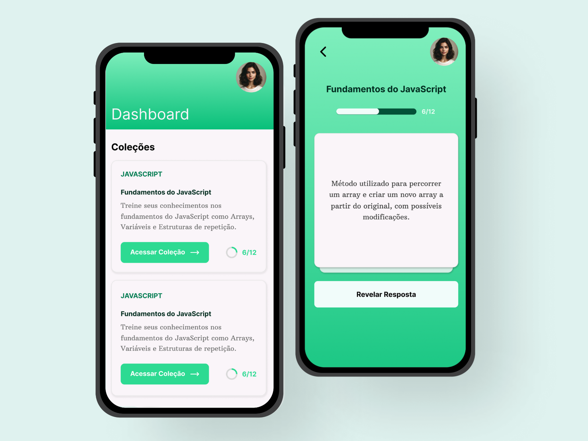

## The Project 
Flash is a responsive project to helps students memorize the content. It was inspired by the flashcards methodology, a study ludic approach to fix the knowledge when we have a lot of topics to learn.

The main challenge was to create a full front-end project. In this context, it was required to initiate the ideation in Figma, defining the design system specifications, patterns and illustrating the page layouts.

After that, it was practiced the migration of Figma specifications to the development environment, integrating with the Tailwind CSS to keep the key visual patterns, and componenting the page elements, using ReactJS and NextJS.

The project was created for #semanaNitro, organized by Rocketseat Technology School, in which developers can put into practice their coding skills and solve the exercises.

## Technologies
The technologies used were:
- TypeScript;
- Tailwind CSS;
- Figma;
- ReactJS;
- NextJS;

## Layout
You can see the project's layout at [link](https://www.figma.com/file/hGh6xJd89QjD3q269tIDM0/Nitro-RocketSeat?type=design&node-id=8%3A235&mode=design&t=d9aDWShvyAjlo7I6-1). 
A [Figma](https://www.figma.com) account is required.